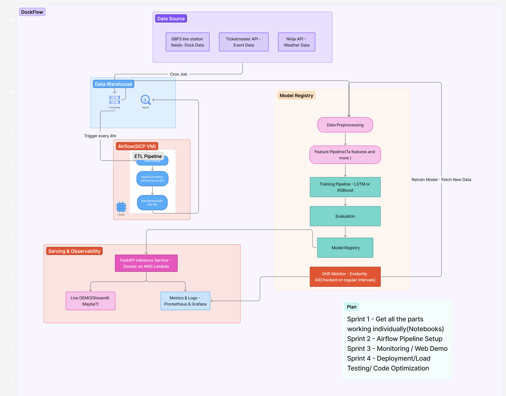

# DockFlow – Real-Time Bike Dock Availability Predictor (San Jose)
---
**Status:** *This project is currently in active development. Components will be implemented incrementally.*

## Overview
**DockFlow** is a real-time machine learning system designed to predict Bay Wheels docking station availability within the next 15 minutes. The system combines live GBFS station feeds, weather data, and local event information to forecast dock availability and provide actionable insights for riders and operators.

Key features:
- Multiple data sources including **GBFS live feeds**, **Weather APIs**, and **Event APIs**
- Raw data lake in **Google Cloud Storage (GCS)** with structured analytics in **BigQuery**
- Automated ETL pipelines with **Apache Airflow** running every 4 hours
- Real-time data collection via cron jobs (GBFS: 2min, Weather: 30min, Events: 24hr)
- Drift detection using **Evidently AI** with automated retraining triggers
- Real-time inference service powered by **FastAPI**, containerized in Docker
- Observability and monitoring with **Prometheus & Grafana**
- Web Interface for live predictions and analytics visualization

---

## System Architecture



### 1. Data Sources
- **GBFS Live Station Feeds** – Real-time dock availability and station status (collected every 2 minutes)
- **Weather APIs (Ninja API)** – Weather conditions affecting rider behavior (collected every 30 minutes)  
- **Event APIs (Ticketmaster)** – Local events impacting demand patterns (collected every 24 hours)
---
### 2. Data Lake & Warehouse
- **Raw Data Zone (GCS)** – Immutable, time-partitioned storage for all source data
- **Structured Zone (BigQuery)** – Cleaned and transformed tables for analytics and ML:
  - `stg_gbfs_live` (partitioned by ingest_ts, clustered by station_id)
  - `stg_weather` (partitioned by observation_ts)
  - `stg_events` (partitioned by event_date)
  - `fact_station_minute` (minute-level station snapshots)
  - `features_training` (joined features for modeling)
---
### 3. ETL & Orchestration
- **Apache Airflow (GCP VM)** orchestrates ETL pipelines every 4 hours:
  - Ingests new raw files from GCS → BigQuery staging tables
  - Builds a combined temporal aligned table
  - Handles deduplication, null values and covert's into a valid schema 
- **Cron Jobs** for continuous data collection at optimal frequencies
---
### 4. Model Registry & Training
- **Data Preprocessing** – Missing value handling, normalization, temporal alignment
- **Feature Pipeline** – Temporal patterns, weather conditions, event-based indicators
- **Models:**
  - **XGBoost** (baseline for speed & accuracy)
  - **LSTM** (planned upgrade for sequence-based learning)
- **Model Registry** – Versioned model artifacts with evaluation metadata
---
### 5. Drift Monitoring
- **Evidently AI** monitors:
  - Feature distribution drift (KS/PSI tests)
  - Model performance decay on recent data
- Drift above thresholds automatically triggers retraining workflow
---
### 6. Serving & Observability  
- **FastAPI** inference service (Docker deployment to GCP Cloud Run)
- **Prometheus & Grafana** dashboards tracking:
  - **Model Metrics** – Prediction accuracy, latency, throughput, drift detection results
  - **Pipeline Metrics** – ETL runtimes, data freshness, retraining frequency  
  - **System Metrics** – Resource utilization, uptime, error rates
- **Optional Streamlit** web interface for live demo and station analytics
---
### 7. Automation & Scheduling
**Data Collection (Cron):**
- GBFS live feeds: every 2 minutes
- Weather data: every 30 minutes  
- Event data: every 24 hours
---
**ETL Processing (Airflow):** every 4 hours
- Maintains separation between lightweight collectors and batch processing
- Ensures data consistency and pipeline stability

---

##  Why This Architecture?

**Real Impact:** Helps riders find available docks and assists operators with demand planning

**Production-Ready:** Implements industry best practices:
- Immutable raw data lake with partition pruning
- Structured warehouse for analytics
- Automated drift detection and retraining
- Full observability stack

**Scalable Design:** 
- Time-partitioned storage for efficient querying
- Containerized microservices
- Cloud-native deployment ready

---

## 📊 Raw Data Flow

```
Raw Zone (GCS):
gs://<bucket>/raw/
  gbfs/year=YYYY/month=MM/day=DD/hour=HH/minute=mm/gbfs_<ts>.json
  weather/year=YYYY/month=MM/day=DD/hour=HH/weather_<ts>.json
  events/year=YYYY/month=MM/day=DD/events_<ts>.json
```

**ETL Process:**
GCS Raw Data → BigQuery Staging → Fact Tables → Feature Store → Model Training → Serving

---

##  Development Plan

| Phase | Description |
|-------|-------------|
| **1** | Get all components working individually (Jupyter Notebooks) |
| **2** | Set up complete Airflow pipelines on GCP VM |
| **3** | Implement monitoring & observability with Prometheus & Grafana |
| **4** | Build web demo interface (FastAPI/Streamlit) |
| **5** | Deploy full system to production with Docker & GCP Cloud Run |

---


##  What's Implemented

- [x] GCS raw storage strategy and partitioning scheme
- [x] BigQuery table architecture (staging, facts, features)
- [x] Scheduling strategy (cron collectors + 4-hour Airflow ETL)
- [x] End-to-end system architecture design
- [ ] Individual component development (in progress)
- [ ] Airflow pipeline implementation (in progress)
- [ ] Model training and evaluation
- [ ] Monitoring and observability stack
- [ ] Production deployment

---
## Acknowledgments

- Bay Wheels GBFS feed for real-time station data

*This project adapts production MLOps patterns for real-world bike share demand forecasting, emphasizing reliability, observability, and automated drift detection.*
